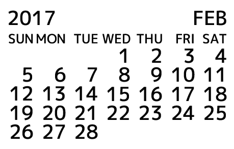

OpenType Calendar Font: Acalendar.ttf
====

## Description
An OpenType font which shows calendar glyphs using OpenType features.

## Usage
Display text such as `2017/02` using `Acalendar.ttf` font with enabling `'liga'` and `'mkmk'` OpenType feature tags (`'mkmk'` is optional — if not enabled, a calendar of a year with more than 5 digits cannot be shown properly).

Acceptable text in regular expression: `\d+[-/]\d{1,2}` whose first `\d+` corresponds to a year (more than 1), while `\d{1,2}` in the end corresponds to a month (from 1 to 12).

## License
Glyph outlines in the font: Copyright (c) 2016 M+ FONTS PROJECT (see http://mplus-fonts.osdn.jp/about-en.html)

Except outlines: MIT License (see `LICENSE`)

## To Generate Font
1. Open `Acalendar.sfd` with Fontforge
2. Select `File` -> `Merge Feature Info...` and open `calendar.fea`
3. Select `File` -> `Generate Fonts...` to generate
